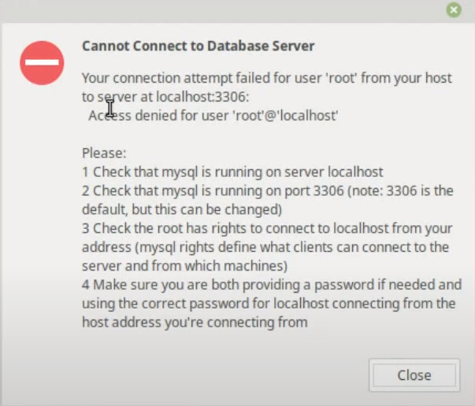

# BANCO DE APRENDIZADO MYSQL

## INSTALANDO O MYSQL NO LINUX MINT/UBUNTU

Primeiro temos que atualizar o linux com os comandos

```bash
$ sudo apt upgrade && update
```

Depois iremos instalar o MySql

```bash
$ sudo apt install mysql-server
```
Posterior vamos criar as senhas de acesso do mySql com o comando:

```bash
$ sudo mysql_secure_installation
```

E depois vamos configurar o **bind-address** para isso vamos acessar o arquivo de conf. pode usar o gdit ou o nano. eu prefiro o gedit.

```bash
$ sudo nano /etc/mysql/mysql.conf.d/mysqld.cnf
```

e dentro do arquivo vamos procurar a linha que esta escrito **bind-address** e fazer a seguinte alteração.

```bash
De:
bind-address            = 127.0.0.1
Para:
bind-address            = 0.0.0.0
```

Recomendo que baixe o workbench pela janela de aplicativos. 

Normalmente quando vai logar nos deparamos com o seguinte error:



e iremos entrar no terminal do MySql com o comando:


```bash
$ sudo mysql -u root
```

e depois vamos fazer a identificação da senha em root

```Sql
ALTER USER 'root'@'localhost' IDENTIFIED WITH mysql_native_password BY 'SuaSenha';

```

